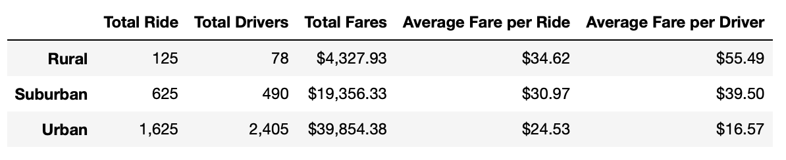

# PyBer_Analysis

## Overview of Project

### Purpose

The purpose of this project is to use Python and Panda to create a summary DataFrame of the Pyber ride-sharing data by city type, and use Pandas and Matplotlib to create a multiple-line graph that shows the total weekly fares for each city type in order to find out how the data differs by city type.

## Results

From the above DataFrame, we can find that:
- Urban cities have the highest ride demand and supply, while rural cities have the least.
- However, urban cities have the lowest average fare per ride and average fare per driver among the three city types, while rural cities have the highest.
- The number of total drivers is greater than the number of total ride (supply is greater than demand) in urban cities, while suppy is less than demand in suburban and rural cities.

The above chart describes total fare by city type vs. month. From the above chart, we can find that: 
- The total fare is lowest in January through February for all three city types, while the total fare is highest in the end of February for urban and suburban cities, and it is the highest in April for rural cities.

## Business Recommandations

- We can increase the number of drivers in suburban and rural cities since the demand is greater than supply, and decrease the number of drivers in urban cities since the number of drivers is 1.5 times greater than the number of riders.
- We can increase the average fare per driver in urban cities because it is almost 2 times lower than in suburban cities and 4 times lower than in rural cities.
- We can slightly increase and decrease the number of drivers in each city type based on different months. 
